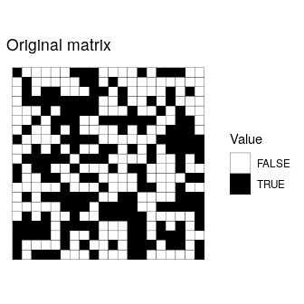
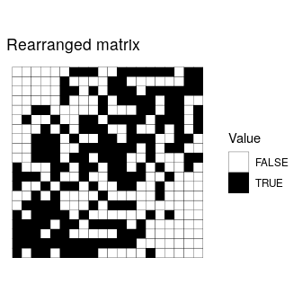
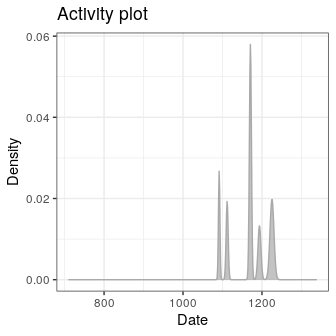
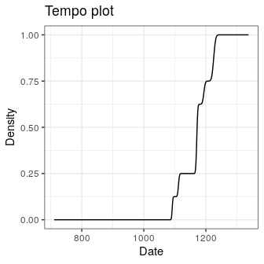

<!-- README.md is generated from README.Rmd. Please edit that file -->

# tabula 

[](https://ci.appveyor.com/project/nfrerebeau/tabula)
[](https://travis-ci.org/nfrerebeau/tabula)
[](https://codecov.io/gh/nfrerebeau/tabula)
[](https://github.com/nfrerebeau/tabula/releases)
[](https://cran.r-project.org/package=tabula)
[](https://cran.r-project.org/package=tabula)
[](https://www.tidyverse.org/lifecycle/#maturing)
[](https://doi.org/10.5281/zenodo.1489944)

## Overview

`tabula` provides an easy way to examine archaeological count data
(artifacts, faunal remains, etc.). This package includes several
measures of diversity: e.g. richness and rarefaction (Chao1, Chao2, ACE,
ICE, etc.), diversity/dominance and evenness (Brillouin, Shannon,
Simpson, etc.), turnover and similarity (Brainerd-Robinson, …). It also
provides matrix seriation methods (reciprocal ranking, CA-based
seriation) for chronological modeling and dating. The package make it
easy to visualize count data and statistical thresholds: rank/abundance
plots, Ford and Bertin diagrams, etc.

## Installation

You can install the released version of `tabula` from
[CRAN](https://CRAN.R-project.org) with:

``` r
install.packages("tabula")
```

Or install the development version from GitHub with:

``` r
# install.packages("devtools")
devtools::install_github("nfrerebeau/tabula")
```

## Usage

`tabula` provides a set of S4 classes that extend the `matrix` data type
from R `base`. These new classes represent different special types of
matrix.

  - Abundance matrix:
      - `CountMatrix` represents count data,
      - `FrequencyMatrix` represents relative frequency data.
  - Logical matrix:
      - `IncidenceMatrix` represents presence/absence data.
  - Other numeric matrix:
      - `OccurrenceMatrix` represents a co-occurence matrix.
      - `SimilarityMatrix` represents a (dis)similarity matrix.

It assumes that you keep your data tidy: each variable (type/taxa) must
be saved in its own column and each observation (sample/case) must be
saved in its own row.

These new classes are of simple use, on the same way as the base
`matrix`:

``` r
# Define a count data matrix
quanti <- CountMatrix(data = sample(0:10, 100, TRUE),
                      nrow = 10, ncol = 10)

# Define a logical matrix
# Data will be coerced with as.logical()
quali <- IncidenceMatrix(data = sample(0:1, 100, TRUE),
                         nrow = 10, ncol = 10)
```

`tabula` uses coercing mechanisms (with validation methods) for data
type conversions:

``` r
# Create a count matrix
A1 <- CountMatrix(data = sample(0:10, 100, TRUE),
                  nrow = 10, ncol = 10)

# Coerce counts to frequencies
B <- as(A1, "FrequencyMatrix")

# Row sums are internally stored before coercing to a frequency matrix
# (use totals() to get these values)
# This allows to restore the source data
A2 <- as(B, "CountMatrix")
all(A1 == A2)
#> [1] TRUE

# Coerce to presence/absence
C <- as(A1, "IncidenceMatrix")

# Coerce to a co-occurrence matrix
D <- as(A1, "OccurrenceMatrix")
```

Several types of graphs are available in `tabula` which uses `ggplot2`
for plotting informations. This makes it easy to customize diagramms
(e.g. using themes and scales).

Spot matrix \[1\] allows direct examination of data:

``` r
# Plot co-occurence of types
# (i.e. how many times (percent) each pairs of taxa occur together 
# in at least one sample.)
ceram_occ <- as(mississippi, "OccurrenceMatrix")
plotSpot(ceram_occ) +
  ggplot2::labs(size = "", colour = "Co-occurrence") +
  ggplot2::theme(legend.box = "horizontal") +
  khroma::scale_colour_YlOrBr()
#> Registered S3 methods overwritten by 'ggplot2':
#>   method         from 
#>   [.quosures     rlang
#>   c.quosures     rlang
#>   print.quosures rlang
```


Bertin or Ford (battleship curve) diagramms can be plotted, with
statistic threshold.

``` r
mississippi_counts <- as(mississippi, "CountMatrix")
plotBertin(mississippi_counts, threshold = mean) +
  khroma::scale_fill_vibrant()
```


``` r
compiegne_counts <- as(compiegne, "CountMatrix")
plotFord(compiegne_counts, EPPM = TRUE) +
  ggplot2::theme(legend.position = "bottom") +
  khroma::scale_fill_bright()
```


The positive difference from the column mean percentage (in french
“écart positif au pourcentage moyen”, EPPM) represents a deviation
from the situation of statistical independence (B. Desachy’s
[sériographe](https://doi.org/10.3406/pica.2004.2396)). EPPM is a
usefull graphical tool to explore significance of relationship between
rows and columns related to seriation.

### Seriation

``` r
# Build an incidence matrix with random data
set.seed(12345)
incidence <- IncidenceMatrix(data = sample(0:1, 400, TRUE, c(0.6, 0.4)),
                             nrow = 20)

# Get seriation order on rows and columns
# Correspondance analysis-based seriation
(indices <- seriate(incidence, method = "correspondance", margin = c(1, 2)))
#> Permutation order for matrix seriation: 
#>    Matrix ID: 2f807bcb-8af5-44e6-a9ac-97c6ee597bf1 
#>    Row order: 20 16 13 4 3 1 9 10 19 2 7 6 17 11 5 14 12 8 15 18 
#>    Column order: 16 1 9 8 4 14 13 18 20 6 7 3 17 2 11 19 5 15 12 10 
#>    Method: correspondance

# Permute matrix rows and columns
incidence2 <- permute(incidence, indices)
```

``` r
# Plot matrix
plotMatrix(incidence) + 
  ggplot2::labs(title = "Original matrix") +
  ggplot2::scale_fill_manual(values = c("TRUE" = "black", "FALSE" = "white"))
plotMatrix(incidence2) + 
  ggplot2::labs(title = "Rearranged matrix") +
  ggplot2::scale_fill_manual(values = c("TRUE" = "black", "FALSE" = "white"))
```



### Dating

This package provides an implementation of the chronological modeling
method developed by Bellanger and Husi
([2012](https://doi.org/10.1016/j.jas.2011.06.031)). This method is
slightly modified here and allows the construction of different
probability density curves of archaeological assembalge dates (*event*,
*activity* and *tempo*). Note that this implementation is experimental
(see `help(dateEvent)`).

``` r
# Coerce dataset to abundance (count) matrix
zuni_counts <- as(zuni, "CountMatrix")
# Assume that some assemblages are reliably dated (this is NOT a real example)
# The names of the vector entries must match the names of the assemblages
setDates(zuni_counts) <- c(
  LZ0569 = 1097, LZ0279 = 1119, CS16 = 1328, LZ0066 = 1111,
  LZ0852 = 1216, LZ1209 = 1251, CS144 = 1262, LZ0563 = 1206,
  LZ0329 = 1076, LZ0005Q = 859, LZ0322 = 1109, LZ0067 = 863,
  LZ0578 = 1180, LZ0227 = 1104, LZ0610 = 1074
)

# Model the event date for each assemblage
model <- dateEvent(zuni_counts, cutoff = 90)
# Plot activity and tempo distributions
plotDate(model, type = "activity", select = "LZ1105") +
  ggplot2::labs(title = "Activity plot") +
  ggplot2::theme_bw()
plotDate(model, type = "tempo", select = "LZ1105") +
  ggplot2::labs(title = "Tempo plot") +
  ggplot2::theme_bw()
```



### Analysis

*Diversity* can be measured according to several indices (sometimes
refered to as indices of *heterogeneity*):

``` r
H <- diversity(
  mississippi_counts, 
  method = c("shannon", "brillouin", "simpson", "mcintosh", "berger"),
  simplify = TRUE
)
head(H)
#>           shannon brillouin   simpson  mcintosh    berger
#> 10-P-1  1.2027955 1.1572676 0.3166495 0.4714431 0.4052288
#> 11-N-9  0.7646565 0.7541207 0.5537760 0.2650711 0.6965699
#> 11-N-1  0.9293974 0.9192403 0.5047209 0.2975381 0.6638526
#> 11-O-10 0.8228576 0.8085445 0.5072514 0.2990830 0.6332288
#> 11-N-4  0.7901428 0.7823396 0.5018826 0.2997089 0.6034755
#> 13-N-5  0.9998430 0.9442803 0.3823434 0.4229570 0.4430380
```

Note that `berger`, `mcintosh` and `simpson` methods return a
*dominance* index, not the reciprocal form usually adopted, so that an
increase in the value of the index accompanies a decrease in diversity.

Corresponding *evenness* (i.e. a measure of how evenly individuals are
distributed across the sample) can also be computed.

Several methods can be used to acertain the degree of *turnover* in taxa
composition along a gradient on qualitative (presence/absence) data. It
assumes that the order of the matrix rows (from \(1\) to \(n\)) follows
the progression along the gradient/transect.

Diversity can also be measured by addressing *similarity* between pairs
of sites:

``` r
# Brainerd-Robinson index
S <- similarity(mississippi_counts, method = "brainerd")

# Plot the similarity matrix
plotSpot(S) +
  ggplot2::labs(size = "Similarity", colour = "Similarity") +
  khroma::scale_colour_iridescent()
```


Ranks *vs* abundance plot can be used for abundance models (model
fitting will be implemented in a futur release):

``` r
count_merzbach1 <- as(merzbach, "CountMatrix")
plotRank(count_merzbach1, log = "xy", facet = FALSE) +
  khroma::scale_colour_discreterainbow() +
  ggplot2::theme_bw()
```


``` r
## Keep only decoration types that have a maximum frequency of at least 50
keep <- apply(X = merzbach, MARGIN = 2, FUN = function(x) max(x) >= 50)
count_merzbach2 <- as(merzbach[, keep], "CountMatrix")

## The data are grouped by phase
## We use the row names as time coordinates (roman numerals)
setDates(count_merzbach2) <- rownames(merzbach)
## Plot time vs abundance and highlight selection
plotTime(count_merzbach2, highlight = "FIT", roll = TRUE) +
  ggplot2::theme_bw() +
  khroma::scale_color_vibrant()
```


## Contributing

Please note that the `tabula` project is released with a [Contributor
Code of Conduct](CODE_OF_CONDUCT.md). By contributing to this project,
you agree to abide by its terms.

1.  Adapted from Dan Gopstein’s original
    [idea](https://dgopstein.github.io/articles/spot-matrix/).
