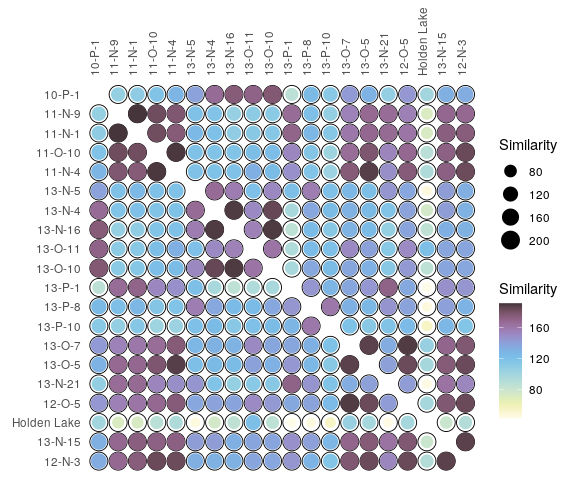

<!-- README.md is generated from README.Rmd. Please edit that file -->
tabula 
===================================================================

[](https://travis-ci.org/nfrerebeau/tabula) [](https://codecov.io/gh/nfrerebeau/tabula) [](https://github.com/nfrerebeau/tabula/releases) [](https://cran.r-project.org/package=tabula) [](https://cran.r-project.org/package=tabula) [](https://www.tidyverse.org/lifecycle/#experimental) [](https://doi.org/10.5281/zenodo.1489944)

Overview
--------

`tabula` provides an easy way to examine archaeological count data (artifacts, faunal remains, etc.). This package includes several measures of diversity: e.g. richness and rarefaction (Chao1, Chao2, ACE, ICE, etc.), diversity/dominance and evenness (Brillouin, Shannon, Simpson, etc.), turnover and similarity (Brainerd-Robinson, ...). It also provides matrix seriation methods (reciprocal ranking, CA-based seriation, IDSS) for chronological modeling and dating. The package make it easy to visualize count data and statistical thresholds: rank/abundance plots, Ford and Bertin diagrams, etc.

Installation
------------

You can install the released version of `tabula` from [CRAN](https://CRAN.R-project.org) with:

``` r
install.packages("tabula")
```

Or install the development version from GitHub with:

``` r
# install.packages("devtools")
devtools::install_github("nfrerebeau/tabula")
```

Usage
-----

`tabula` provides a set of S4 classes that extend the `matrix` data type from R `base`. These new classes represent different special types of matrix.

-   Abundance matrix:
    -   `CountMatrix` represents count data,
    -   `FrequencyMatrix` represents relative frequency data.
    -   `SimilarityMatrix` represents a (dis)similarity matrix.
-   Logical matrix:
    -   `IncidenceMatrix` represents presence/absence data.
    -   `OccurrenceMatrix` represents a co-occurence matrix.

It assumes that you keep your data tidy: each variable (type/taxa) must be saved in its own column and each observation (sample/case) must be saved in its own row.

These new classes are of simple use, on the same way as the base `matrix`:

``` r
# Define a count data matrix
quanti <- CountMatrix(data = sample(0:10, 100, TRUE),
                      nrow = 10, ncol = 10)

# Define a logical matrix
# Data will be coerced with as.logical()
quali <- IncidenceMatrix(data = sample(0:1, 100, TRUE),
                         nrow = 10, ncol = 10)
```

`tabula` uses coercing mechanisms (with validation methods) for data type conversions:

``` r
# Create a count matrix
A1 <- CountMatrix(data = sample(0:10, 100, TRUE),
                  nrow = 10, ncol = 10)

# Coerce counts to frequencies
B <- as(A1, "FrequencyMatrix")

# Row sums are internally stored before coercing to a frequency matrix
# (use totals() to get these values)
# This allows to restore the source data
A2 <- as(B, "CountMatrix")
all(A1 == A2)
#> [1] TRUE

# Coerce to presence/absence
C <- as(A1, "IncidenceMatrix")

# Coerce to a co-occurrence matrix
D <- as(A1, "OccurrenceMatrix")
```

### Analysis

#### Sample richness

``` r
compiegne <- as(compiegne, "CountMatrix")
richness(compiegne, method = c("margalef", "menhinick", "chao1"), simplify = TRUE)
#>   margalef  menhinick chao1
#> 5 1.176699 0.07933617    13
#> 4 1.323459 0.07568907    15
#> 3 1.412383 0.07905694    16
#> 2 1.429741 0.08432155    16
#> 1 1.428106 0.08381675    16
```

#### Heterogeneity and evenness measures

*Diversity* can be measured according to several indices (sometimes refered to as indices of *heterogeneity*):

``` r
diversity(compiegne, method = c("shannon", "brillouin", "simpson", "mcintosh", "berger"), simplify = TRUE)
#>    shannon brillouin   simpson  mcintosh    berger
#> 5 1.311123  1.309565 0.3648338 0.3983970 0.5117318
#> 4 1.838332  1.836827 0.2246218 0.5287042 0.3447486
#> 3 2.037649  2.036142 0.1718061 0.5883879 0.3049316
#> 2 2.468108  2.466236 0.1038536 0.6812886 0.1927510
#> 1 2.297495  2.295707 0.1267866 0.6472862 0.1893524
```

Note that `berger`, `mcintosh` and `simpson` methods return a *dominance* index, not the reciprocal form usually adopted, so that an increase in the value of the index accompanies a decrease in diversity.

Corresponding *evenness* (i.e. a measure of how evenly individuals are distributed across the sample) can also be computed.

#### Turnover and Similarity

The several methods can be used to acertain the degree of *turnover* in taxa composition along a gradient (*β*-diversity) on qualitative (presence/absence) data. It assumes that the order of the matrix rows (from 1 to *n*) follows the progression along the gradient/transect.

*β*-diversity can also be measured by addressing *similarity* between pairs of sites:

``` r
mississippi <- as(mississippi, "CountMatrix")
C <- similarity(mississippi, method = "brainerd")
plotSpot(C)
```



### Seriation

``` r
# Build an incidence matrix with random data
incidence <- IncidenceMatrix(data = sample(0:1, 400, TRUE, c(0.6, 0.4)),
                             nrow = 20)

# Get seriation order on rows and columns
# Correspondance analysis-based seriation
set.seed(12345)
(indices <- seriate(incidence, method = "correspondance", margin = c(1, 2)))
#> Permutation order for matrix seriation: 
#>    Row order: 20 17 2 14 11 10 13 18 4 16 19 15 7 1 5 6 12 8 3 9 
#>    Column order: 12 5 16 8 11 19 13 7 9 6 17 3 14 10 1 20 15 4 18 2 
#>    Method: correspondance

# Permute matrix rows and columns
incidence2 <- permute(incidence, indices)
```

``` r
# Plot matrix
library(ggplot2)
plotMatrix(incidence) + 
  labs(title = "Original matrix") +
  scale_fill_manual(values = c("TRUE" = "black", "FALSE" = "white"))
plotMatrix(incidence2) + 
  labs(title = "Rearranged matrix") +
  scale_fill_manual(values = c("TRUE" = "black", "FALSE" = "white"))
```


### Visualization

`tabula` makes an extensive use of `ggplot2` for plotting informations. This makes it easy to customize diagramms (e.g. using themes and scales).

Bertin of Ford (battleship curve) diagramms can be plotted, with statistic threshold ([B. Desachy's *sériographe*](https://doi.org/10.3406/pica.2004.2396)). The positive difference from the column mean percentage (in french "écart positif au pourcentage moyen", EPPM) represents a deviation from the situation of statistical independence. EPPM is a usefull graphical tool to explore significance of relationship between rows and columns related to seriation.

``` r
count <- as(compiegne, "CountMatrix")
plotBar(count, EPPM = TRUE)
```


Matrix plot is displayed as a heatmap. The PVI matrix ([B. Desachy's *matrigraphe*](https://doi.org/10.3406/pica.2004.2396)) allows to explore deviations from independence (an intuitive graphical approach to *χ*<sup>2</sup>).

``` r
plotMatrix(count, PVI = TRUE) +
  ggplot2::scale_fill_gradient2(midpoint = 1)
```


Spot matrix (easier to read than a heatmap [1]) allows direct examination of data (above/below some threshold):

``` r
plotSpot(count, threshold = mean)
```


Ranks *vs* abundance plot can be used for abundance models (model fitting will be implemented in a futur release):

``` r
plotRank(count, log = "xy")
```


[1] Adapted from Dan Gopstein's original [spot matrix](https://dgopstein.github.io/articles/spot-matrix/).
